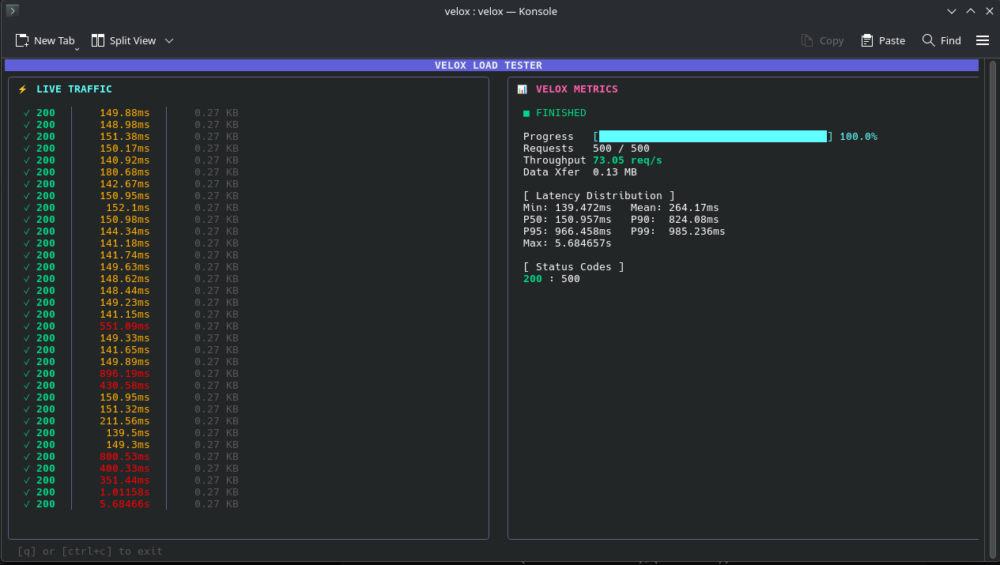

# Velox ⚡


Velox is a high-performance, concurrent HTTP load testing tool written in Go. It features a stunning, real-time Terminal User Interface (TUI) to visualize your API's performance, latency distributions, and live traffic under heavy load.

<p align="center">
  
</p>

## ✨ Features

- **Blazing Fast:** Built with Go's powerful concurrency model (goroutines and channels) to easily simulate thousands of requests.
- **Beautiful TUI:** A responsive, live-updating dashboard powered by Bubble Tea and Lipgloss.
- **Live Metrics:** Real-time Requests Per Second (RPS), Data Transfer, and Status Code distributions.
- **Latency Analytics:** Calculates Min, Max, Mean, P50, P90, P95, and P99 percentiles on the fly.
- **Visual Sparklines:** Fixed timeline trend graphs to visualize latency spikes.
- **Quick Restart:** Press `R` during or after a test to instantly restart the load test with the same parameters.

## 🚀 Installation

Make sure you have Go installed, then run:

```bash
go install github.com/berkantsoytas/velox@latest
```

## 🛠️ Usage

Basic load test with 500 requests and 50 concurrent workers:

```bash
velox -u https://example.com/api -n 500 -c 50
```

### Advanced Usage (Headers, POST payload)

```bash
velox -u https://example.com/api/login \
  -X POST \
  -n 1000 \
  -c 100 \
  -H "Content-Type: application/json" \
  -H "Authorization: Bearer my-token" \
  -d '{"username":"admin", "password":"password123"}'

```

### Available Flags

| Flag | Short | Description | Default |
| --- | --- | --- | --- |
| `--url` | `-u` | Target URL (e.g., <http://localhost:8080>) | **Required** |
| `--requests` | `-n` | Total number of requests to perform | `100` |
| `--concurrency` | `-c` | Number of multiple requests to make at a time | `10` |
| `--method` | `-X` | HTTP Method (GET, POST, PUT, DELETE, etc.) | `GET` |
| `--data` | `-d` | HTTP Request Body | empty |
| `--header` | `-H` | Custom HTTP headers (can be used multiple times) | empty |

## ⌨️ Controls

- `R` or `r` : Restart the load test instantly.
- `Q` or `Ctrl+C` : Quit the application safely.

## 📄 License

This project is licensed under the **GNU General Public License v3.0 (GPLv3)**.
See the [LICENSE](https://www.github.com/berkantsoytas/velox/license) file for details.
